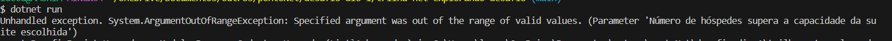
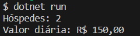
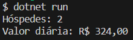

# DIO - Trilha .NET - Explorando a linguagem C#
www.dio.me

## Desafio de projeto
Para este desafio, você precisará usar seus conhecimentos adquiridos no módulo de explorando a linguagem C#, da trilha .NET da DIO.

## Contexto
Você foi contratado para construir um sistema de hospedagem, que será usado para realizar uma reserva em um hotel. Você precisará usar a classe Pessoa, que representa o hóspede, a classe Suíte, e a classe Reserva, que fará um relacionamento entre ambos.

O seu programa deverá cálcular corretamente os valores dos métodos da classe Reserva, que precisará trazer a quantidade de hóspedes e o valor da diária, concedendo um desconto de 10% para caso a reserva seja para um período maior que 10 dias.

## Regras e validações
1. Não deve ser possível realizar uma reserva de uma suíte com capacidade menor do que a quantidade de hóspedes. Exemplo: Se é uma suíte capaz de hospedar 2 pessoas, então ao passar 3 hóspedes deverá retornar uma exception.
2. O método ObterQuantidadeHospedes da classe Reserva deverá retornar a quantidade total de hóspedes, enquanto que o método CalcularValorDiaria deverá retornar o valor da diária (Dias reservados x valor da diária).
3. Caso seja feita uma reserva igual ou maior que 10 dias, deverá ser concedido um desconto de 10% no valor da diária.


## Solução
1. <i>Não deve ser possível realizar uma reserva de uma suíte com capacidade menor do que a quantidade de hóspedes. Exemplo: Se é uma suíte capaz de hospedar 2 pessoas, então ao passar 3 hóspedes deverá retornar uma exception.</i>

   * Para demonstrarmos a exception vamos incluir mais um hóspede em `Program.cs`.

     ````c#
     List<Pessoa> hospedes = new List<Pessoa>();
     
     Pessoa p1 = new Pessoa(nome: "Hóspede 1");
     Pessoa p2 = new Pessoa(nome: "Hóspede 2");
     Pessoa p3 = new Pessoa(nome: "Hóspede 3");
     
     hospedes.Add(p1);
     hospedes.Add(p2);
     hospedes.Add(p3);
     ````

   * Montamos o método <b>CadastrarHospedes</b> em `Reserva.cs` da seguinte forma:
   
     ````c#
     public void CadastrarHospedes(List<Pessoa> hospedes)
             {
                 int NumeroDeHospedes = hospedes.Count;
                 int CapacidadeSuite = Suite.Capacidade;
     
                 if (CapacidadeSuite >= NumeroDeHospedes)
                 {
                     Hospedes = hospedes;
                 }
                 else
                 {
     
                     throw new System.ArgumentOutOfRangeException("Número de hóspedes supera a capacidade da suite escolhida");
     
                 }
             }
     ````

   * Portanto temos este resultado no terminal abaixo: 
   
     
   
2. <i>O método ObterQuantidadeHospedes da classe Reserva deverá retornar a quantidade total de hóspedes, enquanto que o método CalcularValorDiaria deverá retornar o valor da diária (Dias reservados x valor da diária).</i>

  * Para esta demonstração vamos voltar para condição inicial de haver 2 hóspedes em `Program.cs`.

    ````c#
    List<Pessoa> hospedes = new List<Pessoa>();
    
    Pessoa p1 = new Pessoa(nome: "Hóspede 1");
    Pessoa p2 = new Pessoa(nome: "Hóspede 2");
    // (Demonstração 1) Pessoa p3 = new Pessoa(nome: "Hóspede 3");
    
    hospedes.Add(p1);
    hospedes.Add(p2);
    // (Demonstração 1) hospedes.Add(p3);
    ````

  * Montamos o método <b>ObterQuantidadeHospedes</b> em `Reserva.cs` da seguinte forma:

    ````c#
    public int ObterQuantidadeHospedes()
            {
                int NumeroDeHospedes = Hospedes.Count;
    
                return NumeroDeHospedes;
            }
    ````

  * Depois elaboramos <b>CalcularValorDiaria</b> em `Reserva.cs` dessa forma.

    ````c#
    public decimal CalcularValorDiaria()
            {
    
                decimal valorDiariaSuite = Suite.ValorDiaria;
                int diasReservados = DiasReservados;
    
                decimal valor = valorDiariaSuite * diasReservados;
    
                if (diasReservados >= 10)
                {
                    valor *= 0.9M;
                }
    
                return valor;
            }
    ````

  * Por fim se executarmos o programa no terminal, teremos o seguinte resultado:

  * 

3. <i>Caso seja feita uma reserva igual ou maior que 10 dias, deverá ser concedido um desconto de 10% no valor da diária.</i>

   * Agora para demonstrar esse terceiro caso vamos alterar a criação do objeto <b>Reserva</b> dentro de `Program.cs` reconfigurando o número de dias reservados de 5 para 12.

     ````c#
     //Reserva reserva = new Reserva(diasReservados: 5);
     Reserva reserva = new Reserva(diasReservados: 12);
     ````

   * Dado que o valor da suíte no programa é de R$ 30,00, o valor cheio da reserva será de R$ 360,00. Felizmente o programa irá calcular esse preço com desconto de 10% como você podem ver abaixo.

      


<B>FORTE ABRAÇO!!</B>